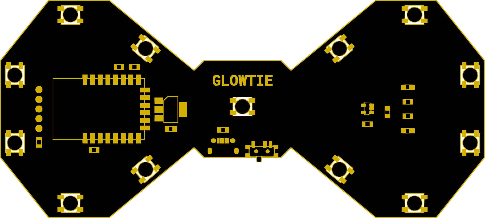

# Glowtie
## The light-up bowtie you control over Wifi!

Welcome to the source code for the Glowtie! The Glowtie is a light-up bowtie you control over Wifi. The onboard ESP8266 puts out an access point network you can connect to with your phone. Navigate to 192.168.4.1 in your browser and you'll find the Glowtie control page, where you can change the colors and the patterns of the lights.

This Github repository holds all the information needed to create a bowtie, from 3D models to schematics. This page will be helpful if you're looking to recreate the glowtie, or hack it!

For more information about the Glowtie, go to Glowtie.io. 
