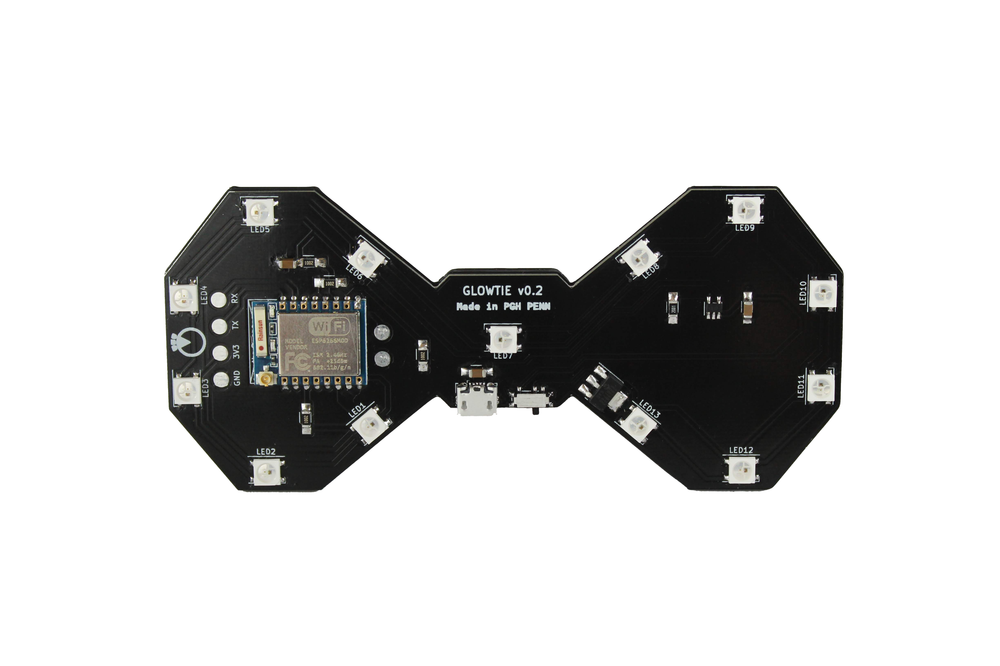

# Glowtie

## The light-up bowtie you control over Wifi

## Connecting to your Glowtie

### Android

1. Turn on your Glowtie. There’s a power switch next to the micro usb jack. You should see a gold burst animation; this means the Wifi network has started.
1. On your Android phone, turn off your mobile data. This is so that your phone doesn’t try to reach the actual internet instead of the Glowtie.
1. Open your Wifi settings and look for a network named in the format “AdjectiveClothing”. For example, it could be “FancyPants” or “CoolCoat”. This is the Serial Name of your Glowtie. Connect to the network.
1. You may get a notification that the network you connected to does not have internet access, no worries! Just choose the option to stay connected if you are provided with one.
1. Now open a new tab in Google Chrome and enter the following in the address field: http://192.168.4.1
1. You should see the Glowtie control page! In your Chrome settings, choose to “Add to Home screen” to make it easier to get to in the future.

### iPhone

1. Turn on your Glowtie. You should see a gold burst animation; this means the Wifi network has started.
1. On your iPhone, navigate to Settings -> Cellular and toggle Cellular Data off. This is so that your phone doesn’t try to reach the actual internet instead of the Glowtie.
1. Open your Wifi settings and look for a network named in the format “AdjectiveClothing”. For example, it could be “FancyPants” or “CoolCoat”. This is the Serial Name of your Glowtie. Connect to the network.
1. You may get a notification that the network you connected to does not have internet access, no worries! Just choose the option to stay connected if you are provided with one.
1. Now open a new tab in Safari or Google Chrome and enter the following in the address field: http://192.168.4.1
1. You should see the Glowtie control page! In your Chrome settings, choose to “Add to Home screen” to make it easier to get to in the future. In Safari, tap the share button and select “Add to Home Screen” to do the same.

## Usage

When you load the Glowtie website, you’ll see three sliders. These represent the red, green, and blue values of the lights. When you adjust them, the title background will adjust to show you what color you’re set to.

Once you pick a color, there’s a few options for animations. Tap the button next to the animation you want, then hit the “UPDATE” button. Your Glowtie will change to whatever you selected!

The Glowtie has a built-in memory function, so once you choose a color and animation it’ll remember your choice after you turn it off. This way, you don’t need to connect to it every time you turn it on if you have it set to your favorite pattern.

## Charging

When the Glowtie has low battery, the center LED will turn red. Use a Micro USB cable to recharge your Glowtie. Make sure your Glowtie is turned off, then plug the Micro USB cable into the port next to the power switch. When you plug the other end into a USB port for power, you should see the **top** light on your Glowtie illuminate. When it’s done charging, the **bottom** light will illuminate.

## Cover

Your Glowtie optionally has a diffusion cover. The cover is held on with a friction fit. Laser cut or print `diffusion.dxf` in a white or clear material, 1/16" thick. Print `bumper.stl` in a color of your choice, and super glue the diffusion inside the bumper. The bumper can now be friction fit onto the Glowtie.

## HACK!

The Glowtie is totally open-source. All PCB design files, firmware, and physical parts are hosted on the Github page. There’s a dedicated programming header on the left side so you can add your own animations, or make it do anything you want! Just solder on a few pins and reprogram the ESP8266 over UART.
